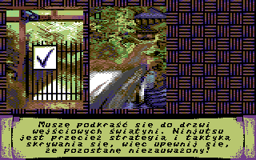
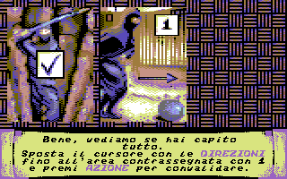
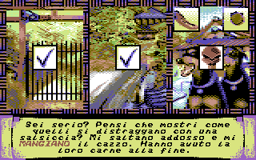

# Ninja Carnage

**The game is a 2 disk side adventure game / semi-textual / Point & click / Die & retry.**

Your mission, to help a Ninja kill the yakuza boss. But there are two problems. First, the Ninja is very “bad ass”. He has a very special sense of humour and he thinks you are a total loser. He is very irreverent.

The second problem is that the final boss is hidden very deep in a temple and your trip will lead you through supernatural situations.

The gameplay is die and retry, meaning that each error will lead the Ninja to death.

There are 29 levels in the game. The texts are more than 10 000 words and there are 128 different deaths for the Ninja.
He got reasons to be angry.

The game is translated into 7 languages (English, German, French, Spanish, Italian, Greek and Polish).

The story is based on japanese culture, historical facts and ghost stories. The yokai are supernatural creatures in the japanese folklore. You’ll face many challenges, but I’m sure you’ll both be victorious…or not.

## License

Ninja Carnage is licensed under Creative Commons CC-BY-NC-SA 
`Attribution-NonCommercial-ShareAlike 3.0 Unported (CC BY-NC-SA 3.0)`

## Commodore 64 version

Download link: https://games.resistance.no/ninja-carnage-commodore-64/

**Release Date:**
28.05.2021

**Code & story:**
C. Kohler (Oriens)

**Art:**
D. Vigh (Grass) based on work of C. Quetier (Ced)

**Music:**
A. Hickman (Dya)

**Title:**
D. Vigh (Grass)

**Logo/Cover Art:**
F. Gutherz (Fra)

**Translations:**
A. Pastore (Italian), C. Townsend (English),
Manos Sg (Greek), H. Alarcon, MiguelSky, Robcfg, Trocoloco (Spanish), S.Böcker (German),
Piotr “Sachy” Sachanowicz, Krystian “Tygrys” Włosek, Szymon “Sim1” Pszczoliński (Polish)

**Coordination:**
O. Stokka (4pLaY)

**Requirements:**
Commodore 64

**File-size:**
2 Disk